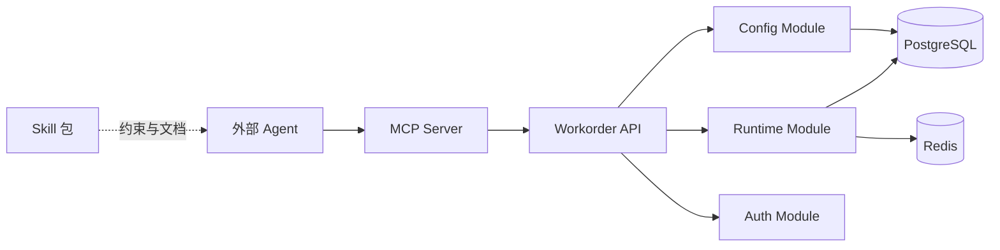

# 智能工单服务 + MCP/Skill 设计规格

> 范围：**B** — 自研工单服务本体 + 工单相关 Skill/MCP  
> 不包含：微信公众号 H5、对话 Agent、知识库、高德  
> 参考模型：NexField OS 物业 AI 客服工单模块（仅业务对齐，不依赖其后台）

---

## 1. 目标与成功标准

### 1.1 目标

构建一套**独立可运行**的工单服务，覆盖：

- 配置管理（类型、字段、流程、派单、通知、计划、发布）
- 工单运行（创建、暂存、提交、审批、转交、查询、台账）
- **MCP Server**：供外部 Agent 通过标准工具调用工单能力
- **Skill 包**：描述 Agent 如何正确调用 MCP、补全字段、处理异常

### 1.2 成功标准（B 阶段 MVP = B1+B2）

| 能力 | 验收 |
|------|------|
| 配置 | 可定义至少 2 种工单类型 + 动态表单字段 + 简单线性流程 |
| 运行 | 用户可暂存/提交工单，产生待办，处理人可审批完成 |
| 查询 | 按单号/状态/创建人查询工单与进度 |
| MCP | Agent 通过 MCP 完成「列类型 → 拿 schema → 建单 → 查进度」 |
| Skill | 安装 Skill 后 Agent 知道何时建单、缺字段如何追问 |

---

## 2. 总体架构

```
packages/
  workorder-api/          # 后端服务（REST + 领域逻辑）
  workorder-mcp/          # MCP Server（薄层，调 workorder-api）
  workorder-skill/        # SKILL.md + 配置说明模板
  workorder-sdk/          # 可选：TS 客户端，供 MCP 与后续 H5 复用

infra/
  docker-compose.yml      # PostgreSQL + Redis
  migrations/             # 数据库迁移
```



### 2.1 设计原则

1. **配置驱动运行**：工单类型、字段、流程、派单规则以「已发布配置版本」为准。
2. **动态表单 JSON 存储**：`form_schema`（定义）与 `form_data`（实例值）分离。
3. **流程与表单解耦**：流程定义引用 `flow_key`，节点可绑定表单权限（只读/可编辑/隐藏）。
4. **MCP 薄封装**：业务规则在 API 层，MCP 只做参数映射与自然语言友好命名。
5. **为多租户预留**：第一版单租户，表结构带 `tenant_id` 默认值。

---

## 3. 领域模块

### 3.1 基础域（Foundation）

| 实体 | 说明 |
|------|------|
| `Project` | 项目/园区 |
| `Space` | 空间（楼栋、楼层、房间、公区路线） |
| `User` | 用户/员工 |
| `Role` | 角色 |
| `Team` | 班组 |
| `Shift` | 班次 |

关系：`Project` 1—N `Space`；`User` N—N `Role`；`Team` N—N `User`；`Shift` 用于值班匹配。

### 3.2 配置域（Config）

| 实体 | 说明 |
|------|------|
| `WorkorderType` | 工单类型：code、name、group（访客通行/报修/巡检/保洁/工程）、default_flow_key |
| `FormField` | 字段定义：key、label、type、required、options、validation、sort |
| `FlowTemplate` | 流程模板：flow_key、version、definition（JSON 状态机） |
| `FlowNode` | 节点：node_key、name、type（start/task/gateway/end）、assignee_rule |
| `SlaPolicy` | SLA：timeout_hours、escalation_action |
| `DispatchRule` | 派单：匹配条件 + executor_mode（ON_DUTY_TEAM / FIXED_TEAM）+ fallback |
| `NotificationTemplate` | 通知模板：event、channel、content_template |
| `WorkPlan` | 计划工单：schedule_rule、template_flow_key、scope JSON |
| `ConfigVersion` | 配置版本：draft / published、published_at |

**配置发布**：运行态只读 `published` 版本；草稿编辑不影响线上。

### 3.3 运行域（Runtime）

| 实体 | 说明 |
|------|------|
| `Workorder` | 工单主表：no、type_code、status、form_data、space_id、creator_id |
| `FlowInstance` | 流程实例：flow_key、status、current_node_key |
| `JobTask` | 任务：assignee_id、status（pending/done/rejected）、belong_type（todo/cc/sign） |
| `WorkorderEvent` | 事件流水：action、operator_id、payload、created_at |
| `WorkorderException` | 异常：type（sla_timeout/dispatch_fail）、status |
| `PlanExecution` | 计划执行记录 |

**工单状态**（建议）：

```
DRAFT → SUBMITTED → IN_PROGRESS → COMPLETED
                  ↘ CANCELLED / TERMINATED
```

**任务状态**：`PENDING` | `DONE` | `REJECTED` | `TRANSFERRED`

### 3.4 开放域（Open API，B 阶段最小实现）

| 实体 | 说明 |
|------|------|
| `OpenApp` | 应用凭证：app_key、app_secret、scopes |
| `ApiCallLog` | 调用审计 |

---

## 4. 流程引擎（第一版：轻量状态机）

不自研可视化流程设计器。第一版用 **JSON 状态机** 表达流程，对齐 NexField JsonFlow 概念但简化：

```json
{
  "flow_key": "repair_flow",
  "version": 1,
  "nodes": [
    { "key": "start", "type": "start", "next": "dispatch" },
    { "key": "dispatch", "type": "task", "name": "派单", "assignee_rule": "dispatch_rule", "next": "handle" },
    { "key": "handle", "type": "task", "name": "处理", "assignee_rule": "assignee", "next": "review" },
    { "key": "review", "type": "task", "name": "验收", "assignee_rule": "creator", "next": "end" },
    { "key": "end", "type": "end" }
  ]
}
```

支持能力（B1+B2）：

- 串行节点
- 指定处理人 / 派单规则 / 创建人
- 同意、驳回（回退到上一节点或指定节点）
- 转交、催办
- 完成、终止

**延后**：并行网关、子流程、可视化设计器（B4+ 或独立迭代）。

---

## 5. REST API 设计

Base path: `/api/v1`

### 5.1 认证

- 第一版：**API Key**（`Authorization: Bearer <token>`）+ `X-User-Id`（模拟当前用户，供 Agent 代操作）
- 后续：JWT / OAuth2

### 5.2 配置 API

| Method | Path | 说明 |
|--------|------|------|
| GET | `/workorder-types` | 列表（仅 published） |
| GET | `/workorder-types/{code}` | 类型详情含 form_schema |
| GET | `/workorder-types/{code}/form-schema` | 动态表单定义 |
| GET | `/config/summary` | 当前生效配置摘要 |
| POST | `/config/publish` | 发布配置（管理端） |

### 5.3 运行 API

| Method | Path | 说明 |
|--------|------|------|
| POST | `/workorders/draft` | 暂存 |
| POST | `/workorders` | 提交（发起流程） |
| GET | `/workorders/{id}` | 详情含流程进度 |
| GET | `/workorders` | 列表（筛选：status、type、creator、keyword） |
| GET | `/workorders/no/{workorderNo}` | 按单号查询 |
| POST | `/tasks/{id}/complete` | 完成任务（审批/处理） |
| POST | `/tasks/{id}/reject` | 驳回 |
| POST | `/tasks/{id}/transfer` | 转交 |
| POST | `/tasks/{id}/remind` | 催办 |
| GET | `/tasks/todo` | 我的待办 |
| GET | `/tasks/cc` | 抄送我的 |

### 5.4 响应约定

```json
{
  "code": 0,
  "message": "ok",
  "data": { }
}
```

错误码示例：`40001` 缺必填字段、`40003` 无权限、`40401` 工单不存在、`40901` 流程已结束。

---

## 6. MCP Server 设计

独立进程，通过 HTTP 调用 `workorder-api`。

### 6.1 环境变量

| 变量 | 说明 |
|------|------|
| `WORKORDER_API_BASE` | API 根地址 |
| `WORKORDER_API_TOKEN` | 服务级 API Key |
| `WORKORDER_DEFAULT_USER_ID` | 默认操作用户（可被 tool 参数覆盖） |

### 6.2 Tools（第一版）

| Tool | 用途 |
|------|------|
| `workorder_list_types` | 列出可用工单类型及说明 |
| `workorder_get_form_schema` | 获取某类型的字段定义（必填/选填/选项） |
| `workorder_create_draft` | 暂存工单 |
| `workorder_submit` | 提交工单并发起流程 |
| `workorder_get` | 按 id 或单号查详情与进度 |
| `workorder_list` | 列表查询（我的/全部/按状态） |
| `workorder_list_tasks` | 待办/抄送任务列表 |
| `workorder_complete_task` | 处理/审批任务 |
| `workorder_transfer_task` | 转交任务 |
| `workorder_get_config_summary` | 当前配置版本摘要 |

### 6.3 Tool 入参设计（自然语言友好）

`workorder_submit` 示例：

```json
{
  "type_code": "REPAIR",
  "title": "卫生间漏水",
  "description": "3栋2单元501卫生间洗手盆下方漏水",
  "space_id": "optional",
  "contact_phone": "13800138000",
  "extra_fields": { "urgency": "high" }
}
```

服务端将 `title`、`description` 等映射到 `FormField.key`，并校验 `form_schema`。

### 6.4 MCP 与配置同步

- 启动时拉取 `/config/summary` 缓存类型列表
- `workorder_get_form_schema` 始终实时拉取（保证字段最新）
- 配置发布后，Skill 文档中的类型说明需人工或脚本 bump 版本（后续可做自动生成）

---

## 7. Skill 包设计

路径：`packages/workorder-skill/SKILL.md`

### 7.1 内容结构

1. **何时使用**：用户要报修、查进度、补充信息、处理待办
2. **标准流程**：`list_types` → `get_form_schema` → 收集缺字段 → `submit` 或 `create_draft`
3. **工单类型话术**：每种类型的必填字段与示例
4. **查询策略**：优先用单号；无单号用列表+关键词
5. **权限与边界**：不可代他人审批（除非 transfer）；不可跳过必填字段
6. **错误处理**：缺字段时明确追问；无权限时提示联系物业
7. **MCP 连接**：安装方式、环境变量

### 7.2 与 MCP 的关系

- **Skill** = Agent 行为指南（when / how / 话术）
- **MCP** = 可执行工具（what / API）

---

## 8. 数据库表（核心）

```
projects, spaces
users, roles, user_roles
teams, team_members, shifts

workorder_types, form_fields
flow_templates, flow_nodes
sla_policies, dispatch_rules, notification_templates
work_plans, config_versions

workorders, flow_instances, job_tasks
workorder_events, workorder_exceptions, plan_executions

open_apps, api_call_logs
```

关键索引：

- `workorders(workorder_no)` UNIQUE
- `workorders(creator_id, status, created_at)`
- `job_tasks(assignee_id, status)`
- `workorder_types(code, config_version_id)`

---

## 9. 分阶段交付

| 阶段 | 内容 | 产出 |
|------|------|------|
| **B1** | 基础表 + 类型/字段配置 API + 建单/查单 | 可手动调 API 建单 |
| **B2** | 轻量流程引擎 + 任务待办 + MCP 8 工具 + Skill v1 | Agent 端到端建单查单 |
| **B3** | 派单规则 + SLA + 异常中心 | 自动派单、超时记录 |
| **B4** | 计划工单 + 配置发布 + 开放应用 | 定时建单、版本管理 |
| **B5** | 管理后台（可选 Web）+ MCP/Skill 打包发布 | 运维可配置、可分发 |

**建议立即启动：B1 + B2**（约 2～3 个迭代，视团队规模）。

---

## 10. 技术栈（默认）

| 层 | 选型 | 理由 |
|----|------|------|
| API | **NestJS + TypeScript** | 与 MCP 同语言，OpenAPI 生态好 |
| ORM | Prisma | 迁移与类型安全 |
| DB | PostgreSQL 16 | JSONB 存 form_data / flow definition |
| 缓存 | Redis | 配置缓存、单号生成 |
| MCP | `@modelcontextprotocol/sdk` | 标准协议 |
| 测试 | Vitest + supertest | API 与 MCP 集成测试 |

如团队以 Java 为主，可替换为 Spring Boot 3，MCP 仍建议独立 TS 服务。

---

## 11. 与 NexField 模型的对齐映射

| NexField 概念 | 本系统 |
|---------------|--------|
| 工单类型 `/types` | `WorkorderType` |
| 表单字段 `/fields` | `FormField` + form-create 兼容 schema |
| 流程与 SLA `/flow-sla` | `FlowTemplate` + `SlaPolicy` |
| 派单规则 `/dispatch` | `DispatchRule` |
| 计划工单 `/plans` | `WorkPlan` |
| 工单台账 `/workorders` | `Workorder` |
| JsonFlow run-flow / run-job | `FlowInstance` / `JobTask` |
| 配置发布 `/config-publish` | `ConfigVersion` |

---

## 12. 风险与对策

| 风险 | 对策 |
|------|------|
| 流程引擎范围膨胀 | 第一版仅串行 + 3 种 assignee_rule |
| 动态表单校验复杂 | 第一版支持 text/textarea/select/date/image/phone 六种 |
| Agent 填错字段 | schema 返回清晰 label + required；服务端返回可读错误 |
| 与后续微信/H5 集成 | API 已 REST 化；用户身份用 `X-User-Id` 预留微信 openid 映射 |

---

## 13. 待确认项（进入实施前）

- [ ] 后端语言：NestJS（默认）或 Spring Boot？
- [ ] 第一版内置工单类型：是否默认「客服报修」+「环境保洁」两种？
- [ ] 单号规则：如 `WO{yyyyMMdd}{6位序号}`？
- [ ] 是否需要管理后台 Web（B2 还是 B5）？

---

*文档版本：v0.1 | 日期：2026-09-01*
